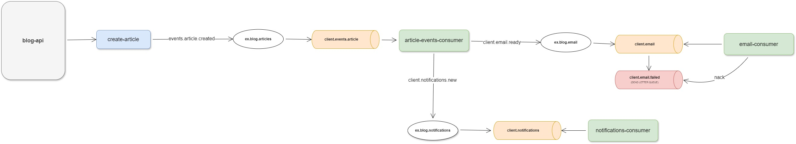

# Email sender and notification system with RabbitMQ



This is a Proof of Concept (POC) project that demonstrates a simple blog application integrated with an email sending feature and a notification system using RabbitMQ for message broker. The goal is to show how to handle asynchronous tasks such as sending notifications when new blog posts are created.


## Requirements
- Node v20 or higher;
- [Docker](https://docs.docker.com/get-started/) and [Docker Compose](https://docs.docker.com/compose/)

## Stack 
- **Backend**: Node.js, Express and Knex;
- **Message Broker**: RabbitMQ;
- **Email Service**: Nodemailer and [mailcatcher](https://mailcatcher.me/);
- **Database**: MySql.

## Install

1. Install dependecies
```bash
yarn
```

2. Create `.env` file in blog-api root
```shell
DB_HOST=localhost
DB_USERNAME=root
DB_PASSWORD=admin
DB_NAME=blog
DB_PORT=3306
RABBITMQ_HOST=localhost
RABBITMQ_PORT=5672
RABBITMQ_USERNAME=guest
RABBITMQ_PASSWORD=guest
```

3. Create `.env` file in email-cosnumer root
```
NODEMAILER_SENDER_EMAIL=sender@gmail.com
NODEMAILER_HOST=localhost
NODEMAILER_PORT=1025
RABBITMQ_HOST=localhost
RABBITMQ_PORT=5672
RABBITMQ_USERNAME=guest
RABBITMQ_PASSWORD=guest
```

4. Start RabbitMQ and MySql (ensure Docker and Docker Compose is installed)
```bash
cd apps/blog-api && docker compose up
```

5. Run migrations
```bash
yarn nx run blog-api:migrate:latest
```

6. Seed database
```bash
yarn nx run blog-api:seed:run
```

7. Run blog-api
```bash
yarn dev:blog-api
```

8. Run email-consumer
```bash
yarn dev:email-consumer
```

## API Documentation
Swagger API documentation is available at:

http://localhost:3000/api-docs

